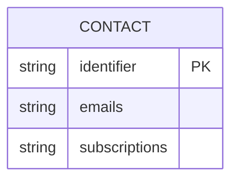
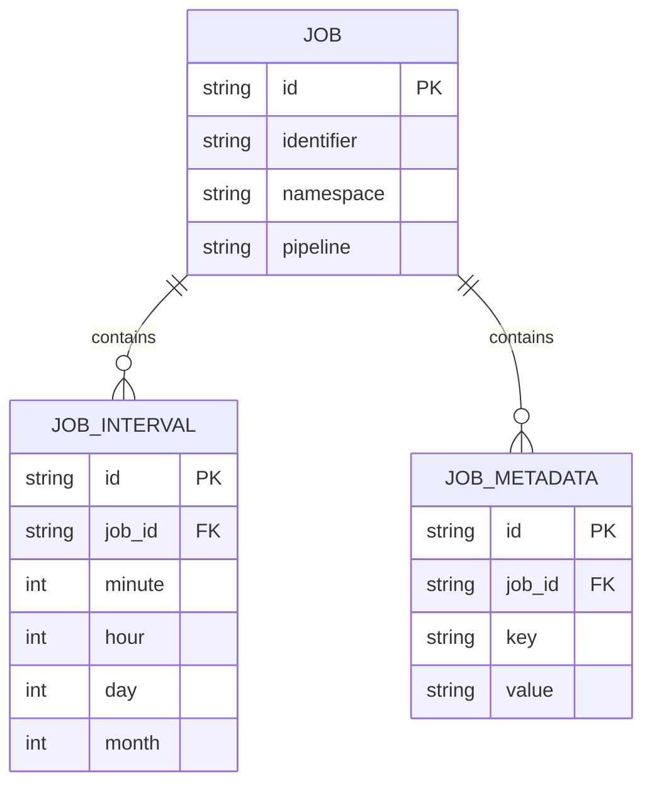
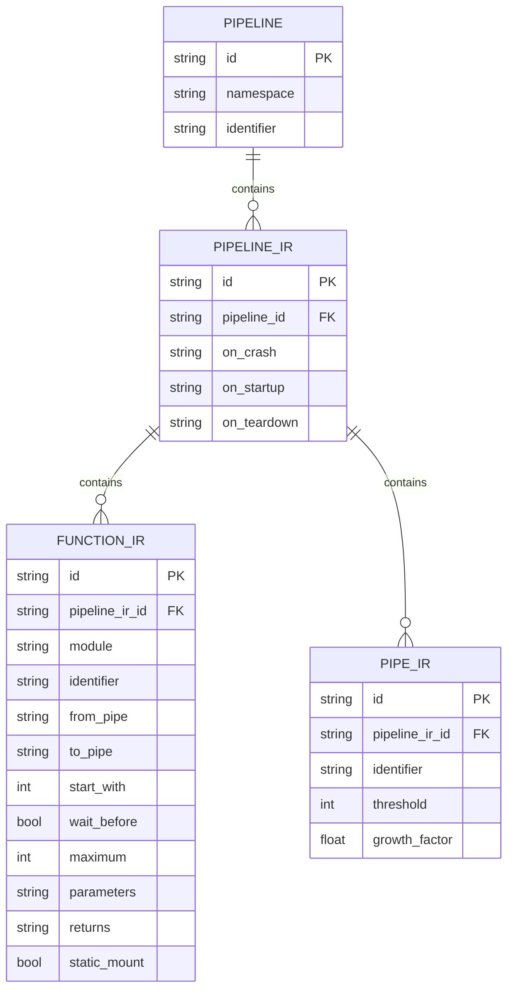
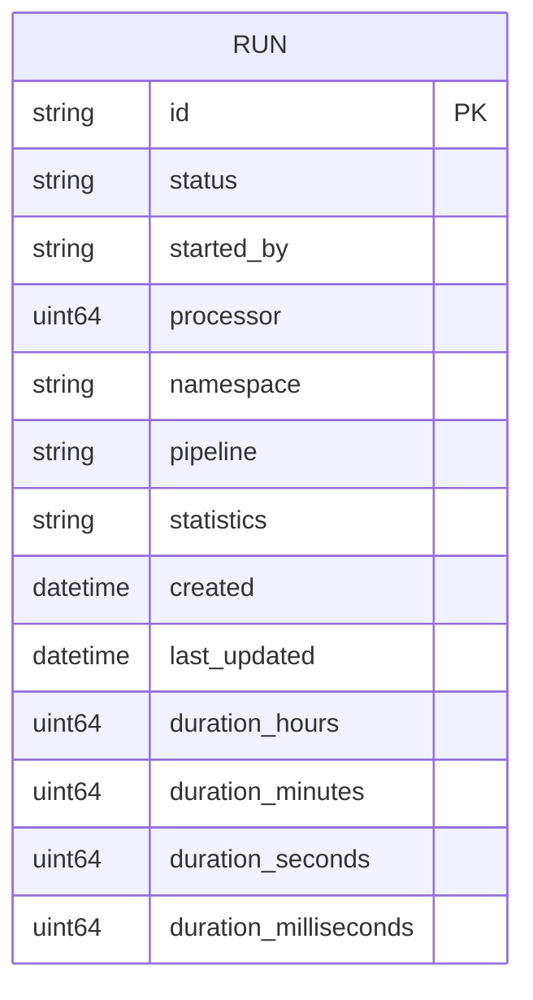
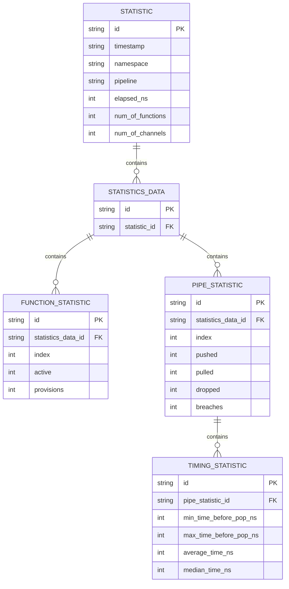

# Core Models
The data models are stored inside the core using `in-memory`, `mongodb` or `sqlite` datastores. 

## Contacts

A `contact` represents a subscriber for event notifications.

## Jobs
A `job` represents a scheduable task the core is responsible for triggering.

## Pipelines

A `pipeline` represents a set of functions and pipes that define a data processing workflow.

## Runs

A `run` represents an execution of a pipeline.

## Statistics

A `statistic` represents runtime statistics for a pipeline execution.

